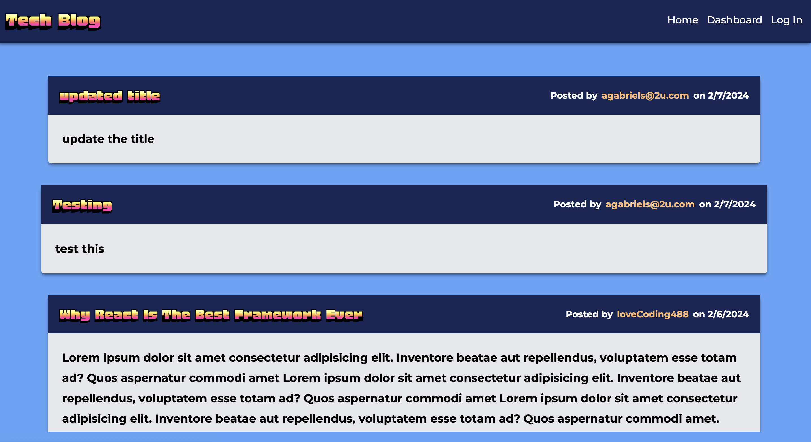
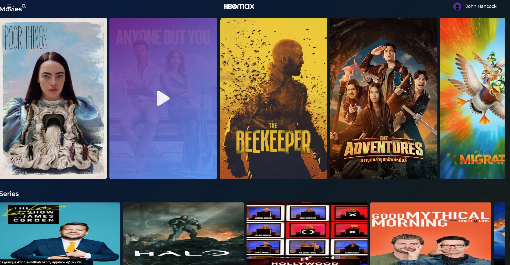
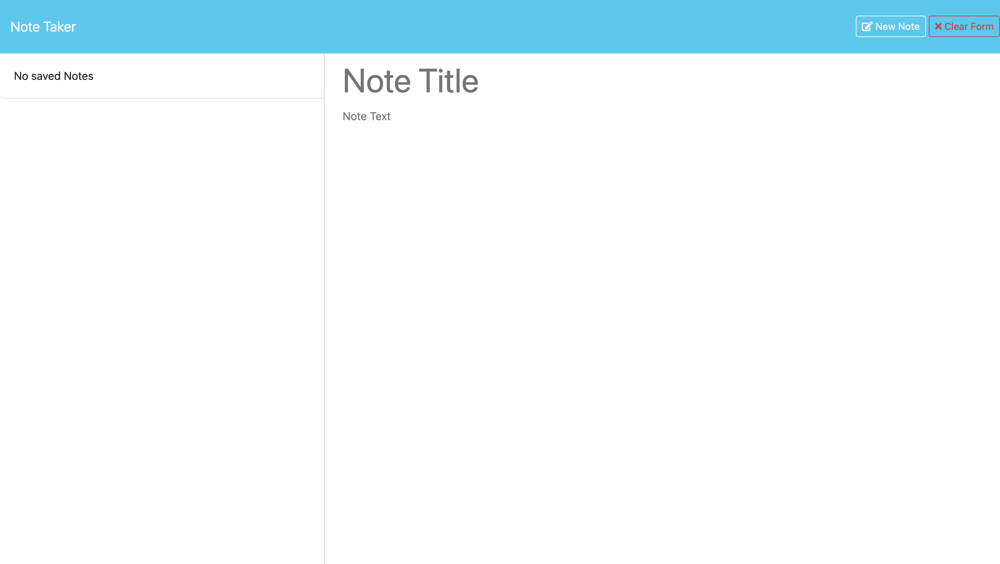
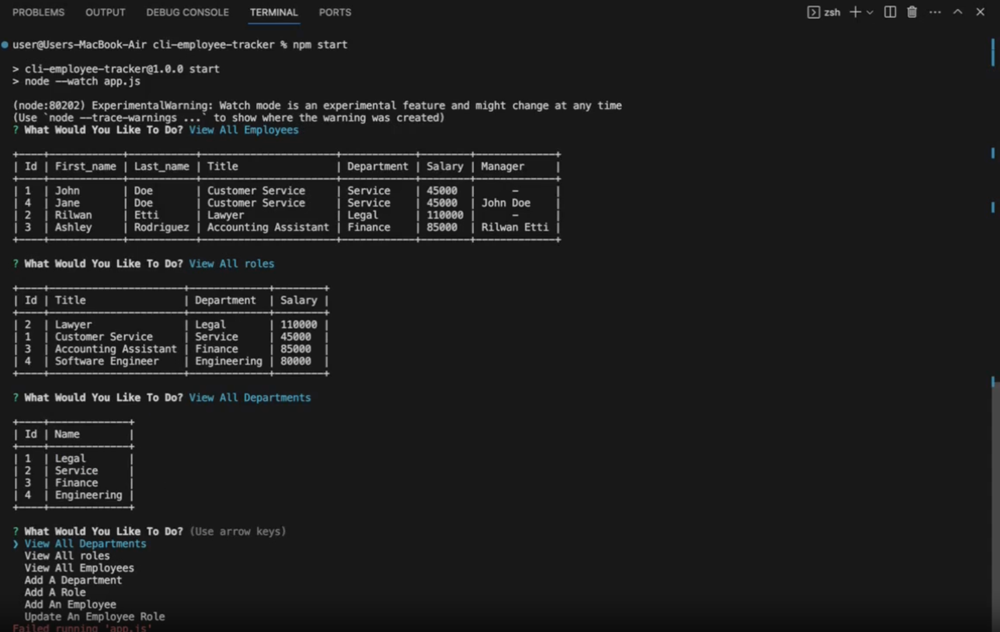

<!--    -->

<h1 align="center">Hi 👋, I'm Rilwan Etti</h1>
<h3 align="center">A full stack developer from Miami, FL</h3>
<h4 align="center">Hey my name is Rilwan Etti, I am a Full Stack Developer based in Pembroke Pines, FL. I am very passsionate about Web Development and increasing my skillset as much as possible. I have recently graduated from a Full Stack Bootcamp at the University Of Miami. </h4>

<!-- TECHS -->

<h2 align="center">Skills</h2>

                 
                    
  
                       
			
                      
                       
                       
                       
		      
		      
		      
		      
		      
		      
		      
                    

 

<!-- PROJECTS -->

<h2 align="center">Projects</h2>

	<table>
		<tr>
			<td width="50%">
<!-- Project One -->
				<h3 align="center">Tech Blog</h3>
				
  
					
					 
					 
					

						  
						
					

					
<strong>HTML, CSS, JavaScript, MySQL, Sequelize, NodeJS, HandlebarsJS, ExpressJS</strong>

          

						This is an application that simulates a blog website with the ability for a user to create an account, create blog posts as well as the ability to edit or delete their existing blog post(s). The user can also comment on pre-existing blog posts from other accounts as well.
					

				

			</td>
			<td width="50%">
<!-- Project Two -->
				<h3 align="center">HBO Clone</h3>
				
  
					
					 
					 
					

						  
							
					

					 
<strong>HTML, CSS, JavaScript, React, NextJS, TailwindCSS</strong>

					
Clone of the popular HBO site. This was one of the first projects i completed using NextJS, NextJS routers, and NextJS Links, and was a project that helped me better understand Next JS and React.

				

        </tr>
	    <tr>
            <td width="50%">
<!-- Project Three -->
                <h3 align="center">Note Taker</h3>
                
  
                    
                     
                     
                    

                          
						
                    

                    
<strong>HTML, CSS, NodeJS, JavaScript, ExpressJS, JSON</strong>

		    
This is a note taking app powered by express.js using json to store all the notes, and fs.writeFile() as the tool that will add or remove data to the json file to persist and/or delete notes

                

            </td>
            <td width="50%">
<!-- Project Four -->
                <h3 align="center">CLI Employee Tracker</h3>
                
  
                    
                     
                     
                    

                          
							
                    

                    
<strong>JavaScript, NodeJS, MySQL</strong>

		    
This is a Node JS application that allows you to create a database for employee information regarding the the name of the employee, their managers, the departments, salary and more. This app was created using inquirer to promot questions in the cli, as well as MySQL to query to a database to save and persist all of the data.

                
	
            </td>
		    <td width="50%">
<!-- Project Six -->
				<h3 align="center">Password Generator</h3>
				
  
					
					 
					 
					

						  
						
					

					
<strong>HTML, CSS, JavaScript, MySQL, Sequelize, NodeJS, HandlebarsJS, ExpressJS</strong>

          

						This is an application that simulates a blog website with the ability for a user to create an account, create blog posts as well as the ability to edit or delete their existing blog post(s). The user can also comment on pre-existing blog posts from other accounts as well.
					

				

			</td>
        </tr>
	</table>

 
 

